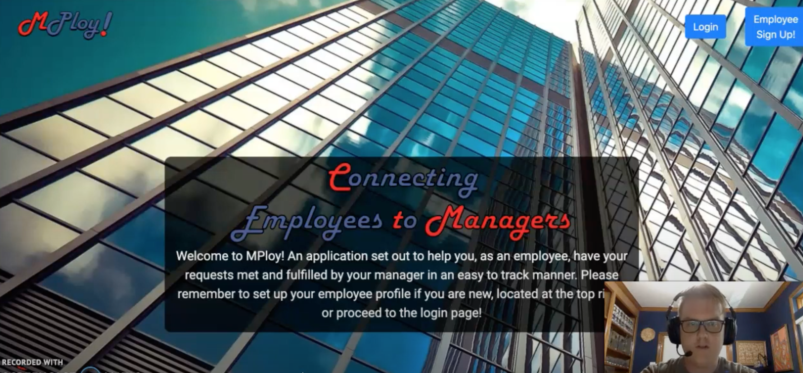

# MPloy!

MPloy! is a Human Resources application that assists both employee and employer keep schedule requests and personalized work history organized and transparent. 

After owning and running my own small business, I saw a need to create something that would help both sides of employment at a company feel included and in control. There are several more areas that can elevate this application to the next level and would be thrilled to have you contribute! Follow the "Contributing" section to learn how!

# Demo

👉 Watch it <a href="https://www.youtube.com/watch?v=cUdRhZERVq0">here!</a>




# Prerequisites

Before you begin, ensure you have done the following:

- You have installed the Ruby on Rails Gem
```
    $ gem install rails
```

- You have started the server
```
    $ rails s
```

# Starting the App

- Proceed to your browser and open up the following in a new tab:
```
    http://localhost:3000/home
```

# Features

✅ Authentication

✅ Self Joiner Model

✅ Admin Login

✅ Persisting Data across Accounts

✅ Growth Opportunities

# Models & Relationships

- Employee has_many :requests
- Employee has_one :manager, through: :requests
- Employee has_one :employee_profile

- EmployeeProfile belongs_to :employee

- Manager has_many :requests
- Manager has_many :employees, through: :requests
- Manager has_one :manager_profile

- ManagerProfile belongs_to :manager
- ManagerProfile has_many :requests, through: :manager

- Request belongs_to :employee
- Request belongs_to :manager
- Request has_one :reason

- Reason belongs_to :request

# User Stories

<h3>MVP<h3>

- Employee can log in
- Employee can make requests
- Employee can view profile

- EmployeeProfile shows previous requests

- Manager can approve requests
- Manager can view Employee request data

- Reasons will be specific w/ Employees being able to expand upon

<h3>Stretch Goals<h3>

- Implement Data Visualization for EmployeeProfile
- Implement Schedule API


# Built With


# Contributing to MPloy!

To contribute to MPloy!, follow these steps:

    1. Fork this repository.
    2. Create a branch: git checkout -b <branch_name>.
    3. Make your changes and commit them: git commit -m "<commit_message>"
    4. Push to the original branch: git push origin <project_name>/<location>
    5. Create the Pull Request.

# Contributers

A special thanks to those who helped get the project off the ground and continued to add to it!

    @Tneebs 💻
    @gocoog 💻

# Contact

If you would like to contact me, you can reach me at tedneben@gmail.com